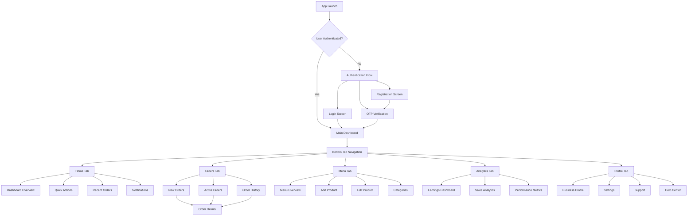
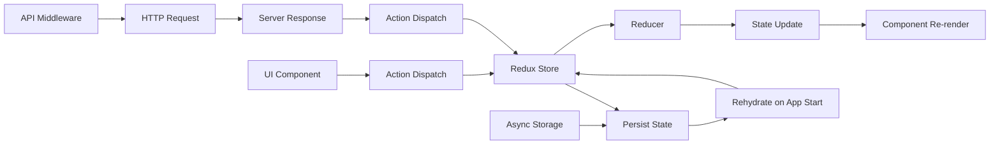
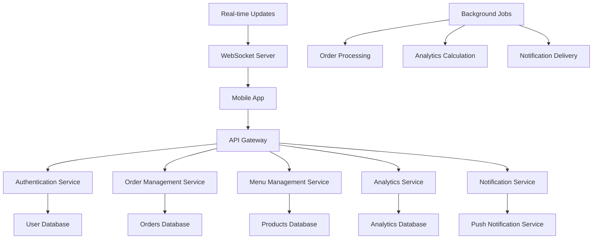
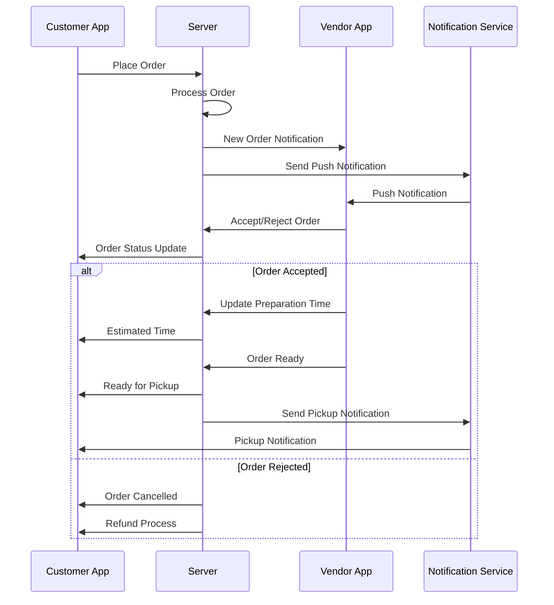
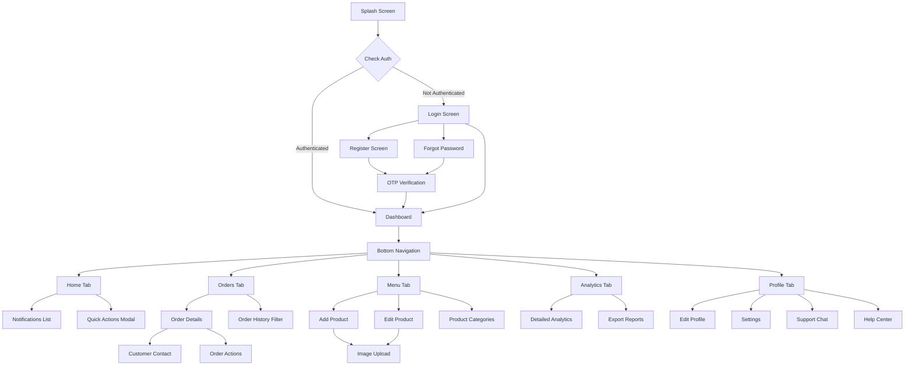
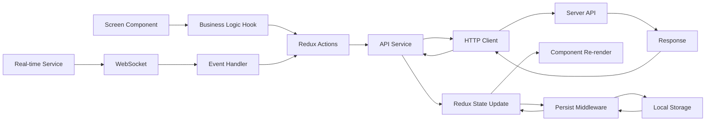
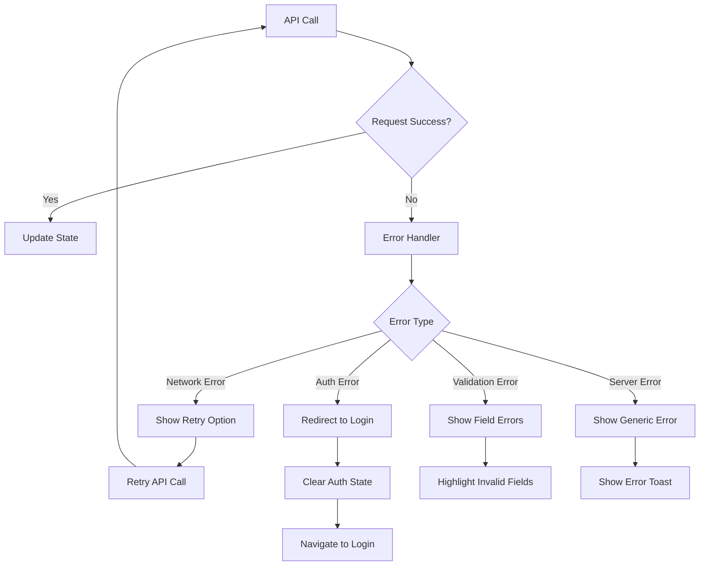
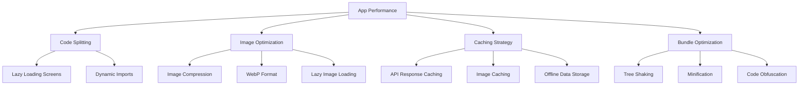
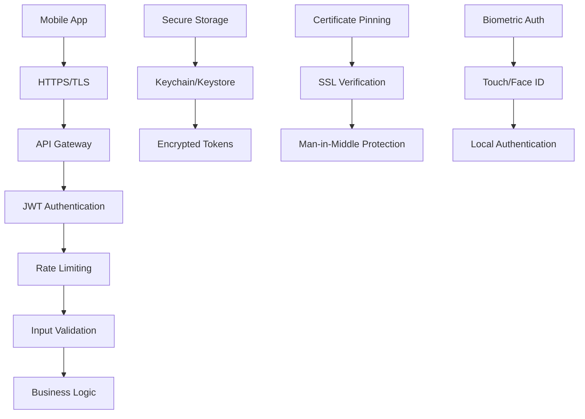

# Vendor Application Architecture Diagrams

## Application Flow Diagram

## Component Architecture

```mermaid
graph TB
    A[App Root] --> B[Navigation Container]
    B --> C[Auth Stack]
    B --> D[Main Tab Navigator]
    
    C --> C1[Login Screen]
    C --> C2[Register Screen]
    C --> C3[OTP Screen]
    
    D --> D1[Home Stack]
    D --> D2[Orders Stack]
    D --> D3[Menu Stack]
    D --> D4[Analytics Stack]
    D --> D5[Profile Stack]
    
    D1 --> D1A[Dashboard Screen]
    D1 --> D1B[Notifications Screen]
    
    D2 --> D2A[Orders List Screen]
    D2 --> D2B[Order Details Screen]
    D2 --> D2C[Order History Screen]
    
    D3 --> D3A[Menu Overview Screen]
    D3 --> D3B[Add Product Screen]
    D3 --> D3C[Edit Product Screen]
    
    D4 --> D4A[Earnings Screen]
    D4 --> D4B[Analytics Screen]
    
    D5 --> D5A[Profile Screen]
    D5 --> D5B[Settings Screen]
    D5 --> D5C[Support Screen]
    
    E[Shared Components] --> E1[Header Component]
    E --> E2[Button Component]
    E --> E3[Input Component]
    E --> E4[Card Component]
    E --> E5[List Item Component]
    E --> E6[Status Badge Component]
    E --> E7[Loading Component]
    E --> E8[Empty State Component]
    
    F[Business Components] --> F1[Order Card]
    F --> F2[Product Card]
    F --> F3[Metric Card]
    F --> F4[Notification Item]
    F --> F5[Review Card]
```

## State Management Flow

## Data Flow Architecture

## Order Processing Workflow

## Screen Navigation Flow

## Component Interaction Flow

## Error Handling Flow

## Performance Optimization Strategy

## Security Architecture

This architecture provides a comprehensive view of how the vendor application will be structured, from high-level user flows to detailed component interactions and security considerations.